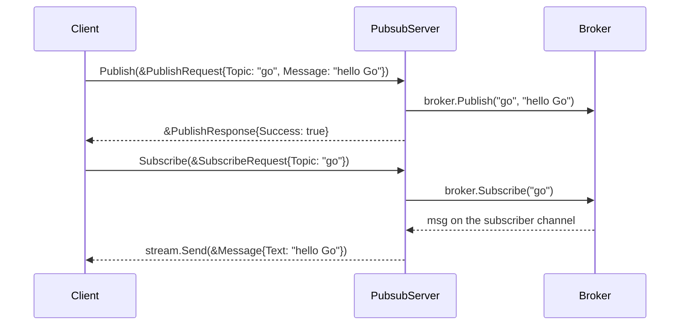

# gRPC and gRPC streaming

Request/reply + streaming over gRPC, put in front of this repo's own
[in-memory `Broker`](./pubsub.md): `Publish` (unary) and `Subscribe` (server-streaming)
become network RPCs instead of in-process calls.

## Why not `net/rpc`

[rpc.md](./rpc.md) covers `net/rpc`: gob-encoded, single-language, no streaming. gRPC trades
simplicity for:

- Wire format (protobuf) + transport (HTTP/2) — cross-language.
- Codegen: write `.proto` once, get matching Go server/client types.
- Streaming, so a call can carry more than one message per direction.
- Cost: a compile step (`.proto` → Go) before the code is usable.

## Design

| File | Purpose |
| --- | --- |
| `proto/gen/pubsub/pubsub.proto` | service + message definitions (hand-written) |
| `proto/pb/pubsub/pubsub.pb.go`, `pubsub_grpc.pb.go` | generated (gitignore-able, rebuilt in CI) |
| `internal/grpc.go` | `PubsubServer` — wraps `*Broker` from [pubsub.md](./pubsub.md) |
| `internal/grpc_test.go` | tests — full round trip via `bufconn`, no real socket |

`Broker` itself doesn't change: same `Subscribe`/`Publish`/`Unsubscribe`/`Close` from
pubsub.md. This layer only translates gRPC calls into calls on it.



```proto
syntax = "proto3";

package pubsub;

option go_package = "github.com/nolannguyen1212/go-playground/proto/pb/pubsub";

message PublishRequest {
  string topic = 1;
  string message = 2;
}

message PublishResponse {
  bool success = 1;
}

message SubscribeRequest {
  string topic = 1;
}

message Message {
  string text = 1;
}

service PubsubService {
  // Unary.
  rpc Publish(PublishRequest) returns (PublishResponse);

  // Streaming — server only.
  rpc Subscribe(SubscribeRequest) returns (stream Message);
}
```

## Toolchain

```sh
go install google.golang.org/protobuf/cmd/protoc-gen-go@latest
go install google.golang.org/grpc/cmd/protoc-gen-go-grpc@latest
brew install bufbuild/buf/buf   # or: go install github.com/bufbuild/buf/cmd/buf@latest
```

[buf](https://buf.build) replaces `protoc`: parses `.proto` itself, drives local plugins.

```yaml
# buf.yaml
version: v2
modules:
  - path: proto/gen
lint:
  use:
    - STANDARD
```

```yaml
# buf.gen.yaml
version: v2
plugins:
  - local: protoc-gen-go
    out: proto/pb
    opt:
      - paths=source_relative
  - local: protoc-gen-go-grpc
    out: proto/pb
    opt:
      - paths=source_relative
```

```sh
buf generate   # → proto/pb/pubsub/pubsub.pb.go, proto/pb/pubsub/pubsub_grpc.pb.go
```

Gotchas:

- **`out: proto/pb` is static — per-service folders come from the source layout.**
  `paths=source_relative` mirrors each `.proto`'s subfolder (under module root
  `proto/gen`) into `out`. `proto/gen/pubsub/pubsub.proto` → `proto/pb/pubsub/`; a future
  `proto/gen/orders/orders.proto` → `proto/pb/orders/`, no `buf.gen.yaml` edit needed.
- **`opt` must be a YAML list**, not a bare string — else buf silently falls back to
  `paths=import` and nests under the full `go_package` path instead of `out`.
- **`go_package` must equal the real output path** (`.../proto/pb/pubsub`) — its last segment
  names the Go package; unrelated to `package pubsub;` in the proto.

## Generated interfaces

```go
type PubsubServiceServer interface {
	Publish(context.Context, *PublishRequest) (*PublishResponse, error)
	Subscribe(*SubscribeRequest, PubsubService_SubscribeServer) error
}

type PubsubServiceClient interface {
	Publish(ctx context.Context, in *PublishRequest, opts ...grpc.CallOption) (*PublishResponse, error)
	Subscribe(ctx context.Context, in *SubscribeRequest, opts ...grpc.CallOption) (PubsubService_SubscribeClient, error)
}

type PubsubService_SubscribeServer interface {
	Send(*Message) error
	grpc.ServerStream
}

type PubsubService_SubscribeClient interface {
	Recv() (*Message, error)
	grpc.ClientStream
}
```

`Subscribe` streams because `Send` returns a channel — this is exactly the `chan any`
returned by `Broker.Subscribe`, discussed in pubsub.md.

## Implementation

```go
package internal

import (
	"context"

	pb "github.com/nolannguyen1212/go-playground/proto/pb/pubsub"
)

type PubsubServer struct {
	pb.UnimplementedPubsubServiceServer // forward-compat for methods not yet implemented

	broker *Broker
}

func NewPubsubServer(broker *Broker) *PubsubServer {
	return &PubsubServer{broker: broker}
}

func (s *PubsubServer) Publish(ctx context.Context, req *pb.PublishRequest) (*pb.PublishResponse, error) {
	s.broker.Publish(Topic(req.GetTopic()), req.GetMessage())
	return &pb.PublishResponse{Success: true}, nil
}

func (s *PubsubServer) Subscribe(req *pb.SubscribeRequest, stream pb.PubsubService_SubscribeServer) error {
	sub := s.broker.Subscribe(Topic(req.GetTopic()))
	defer s.broker.Unsubscribe(sub) // stops the broker blocking on a Publish nobody reads

	for {
		select {
		case msg, ok := <-sub:
			if !ok {
				return nil // broker.Close() shut everything down
			}
			if err := stream.Send(&pb.Message{Text: msg.(string)}); err != nil {
				return err // client disconnected
			}
		case <-stream.Context().Done():
			return stream.Context().Err() // client canceled or disconnected
		}
	}
}
```

- `PubsubServer`, not `Server` — `package internal` already has `RPCService`, `Broker`, `Worker`.
- `msg.(string)`: `Broker` carries `any`; safe here only because this service is the only
  publisher and it always publishes a string.
- `defer s.broker.Unsubscribe(sub)` is the key line: `Broker.Publish` blocks until every
  subscriber receives (pubsub.md), so a stream that never unsubscribes on client
  disconnect would eventually wedge every future `Publish` on that topic.
- No server/client binaries: a real `net.Listen` + `grpcServer.Serve` and the test's
  `bufconn` listener both feed a transport to the same `PubsubServer` — round trip runs
  entirely in `go test` (below).

## Tests

`net.Pipe()` (used in [rpc.md](./rpc.md)) won't work here: it hands back one raw
`net.Conn` pair, but `grpc.Server.Serve` requires a `net.Listener` (something with
`Accept()`). `bufconn.Listen` *is* a `net.Listener`, just backed by memory instead of a
socket — purpose-built for this. Named `newGrpcClient`, not `newClient` — `rpc_test.go`
already defines `newClient` in this same `internal_test` package.

```go
package internal_test

import (
	"context"
	"net"
	"testing"

	"google.golang.org/grpc"
	"google.golang.org/grpc/credentials/insecure"
	"google.golang.org/grpc/test/bufconn"

	"github.com/nolannguyen1212/go-playground/internal"
	pb "github.com/nolannguyen1212/go-playground/proto/pb/pubsub"
)

// newBufconnServer starts a PubsubServer on an in-memory listener and
// returns it, so a test can dial in. Registering the service must happen
// before Serve — grpc-go fatals if RegisterService runs after Serve starts.
func newBufconnServer(t *testing.T, broker *internal.Broker) *bufconn.Listener {
	t.Helper()

	lis := bufconn.Listen(1024 * 1024) // buffer size in bytes
	grpcServer := grpc.NewServer()
	pb.RegisterPubsubServiceServer(grpcServer, internal.NewPubsubServer(broker))

	go grpcServer.Serve(lis)
	t.Cleanup(grpcServer.Stop)

	return lis
}

// newBufconnClient dials lis instead of a real address. grpc.NewClient
// normally resolves its target via DNS; "passthrough:///" skips that, and
// dial supplies the connection instead, ignoring the address gRPC passes it.
func newBufconnClient(t *testing.T, lis *bufconn.Listener) pb.PubsubServiceClient {
	t.Helper()

	dial := func(ctx context.Context, _ string) (net.Conn, error) {
		return lis.DialContext(ctx)
	}
	conn, err := grpc.NewClient("passthrough:///bufnet",
		grpc.WithContextDialer(dial),
		grpc.WithTransportCredentials(insecure.NewCredentials()),
	)
	if err != nil {
		t.Fatal(err)
	}
	t.Cleanup(func() { conn.Close() })

	return pb.NewPubsubServiceClient(conn)
}

func newGrpcClient(t *testing.T) pb.PubsubServiceClient {
	t.Helper()

	broker := internal.NewBroker()
	t.Cleanup(broker.Close)

	lis := newBufconnServer(t, broker)
	return newBufconnClient(t, lis)
}

func TestPublishSubscribe(t *testing.T) {
	client := newGrpcClient(t)

	stream, err := client.Subscribe(context.Background(), &pb.SubscribeRequest{Topic: "go"})
	if err != nil {
		t.Fatal(err)
	}

	// stream.Recv() blocks until a message arrives, so publish from a
	// goroutine — same reason pubsub_test.go publishes from a goroutine.
	go client.Publish(context.Background(), &pb.PublishRequest{Topic: "go", Message: "hello Go"})

	msg, err := stream.Recv()
	if err != nil {
		t.Fatal(err)
	}
	if msg.GetText() != "hello Go" {
		t.Fatalf("got %q, want %q", msg.GetText(), "hello Go")
	}
}
```

```sh
buf generate && go test -race ./...
```

`-race` matters here for the same reason as pubsub.md: `Broker.Publish` and the stream's
`Recv` touch the subscriber channel from different goroutines.
