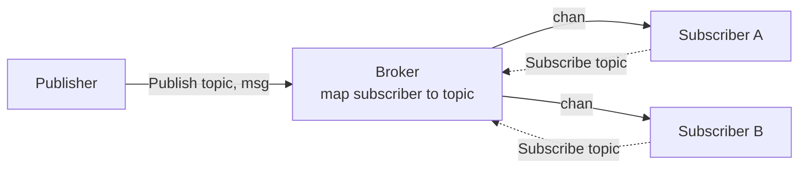

# In-memory Pub/Sub with channels

A minimal publish/subscribe broker built on Go channels.

## Design



- A subscriber is just a `chan any`; only the broker holds state.
- The registry is one map, `subscribers[channel] = topic` — channels are comparable in Go,
  so they work as map keys.
- Channels are unbuffered, so `Publish` blocks until every matching subscriber receives.
- The sender closes: only `Unsubscribe`/`Close` may `close(sub)`, otherwise the broker
  panics with `send on closed channel` on the next publish.
- One `sync.Mutex` guards the map against concurrent Subscribe/Unsubscribe/Publish.

## Implementation

```go
package internal

import "sync"

type (
	Topic      string
	Subscriber chan any
)

const (
	TopicA Topic = "A"
	TopicB Topic = "B"
)

type Broker struct {
	mu          sync.Mutex // value, not *sync.Mutex: zero value is ready to use
	subscribers map[Subscriber]Topic
}

func NewBroker() *Broker {
	return &Broker{subscribers: make(map[Subscriber]Topic)}
}

// Subscribe creates a channel and registers it under the topic.
func (b *Broker) Subscribe(topic Topic) Subscriber {
	b.mu.Lock()
	defer b.mu.Unlock()

	sub := make(Subscriber)
	b.subscribers[sub] = topic

	return sub
}

// Unsubscribe removes the subscriber, then closes its channel to signal end of stream.
func (b *Broker) Unsubscribe(sub Subscriber) {
	b.mu.Lock()
	defer b.mu.Unlock()

	if _, ok := b.subscribers[sub]; !ok {
		return // already unsubscribed; avoid a double close
	}

	delete(b.subscribers, sub)
	close(sub)
}

// Publish delivers msg to every subscriber of the topic, blocking until each receives it.
func (b *Broker) Publish(topic Topic, msg any) {
	b.mu.Lock()
	defer b.mu.Unlock()

	for sub, t := range b.subscribers {
		if t == topic {
			sub <- msg
		}
	}
}

// Close shuts down every subscriber. Use it on shutdown.
func (b *Broker) Close() {
	b.mu.Lock()
	defer b.mu.Unlock()

	for sub := range b.subscribers {
		delete(b.subscribers, sub)
		close(sub)
	}
}
```

## Tests

Tests live in `package internal_test`, so they only see the exported API — the user's point
of view.

Because sends block, a test publishes from a goroutine and receives on the main one. The two
meet at the unbuffered channel, which makes the test deterministic without `time.Sleep`.

```go
package internal_test

import (
	"testing"

	"github.com/go-jose/go-jose/v4/testutils/assert"
	"github.com/nolannguyen1212/go-runbook/internal"
)

// t.Cleanup runs even when a test fails, so no test defers Close itself.
func newBroker(t *testing.T) *internal.Broker {
	t.Helper()

	broker := internal.NewBroker()
	t.Cleanup(broker.Close)

	return broker
}

func TestPublishByTopic(t *testing.T) {
	broker := newBroker(t)

	a := broker.Subscribe(internal.TopicA)
	b := broker.Subscribe(internal.TopicB)

	go broker.Publish(internal.TopicA, "hello A")

	assert.Equal(t, <-a, "hello A")

	// b listens to another topic, so nothing is waiting for it.
	select {
	case msg := <-b:
		t.Fatalf("b should receive nothing, got %v", msg)
	default:
	}
}

func TestUnsubscribe(t *testing.T) {
	broker := newBroker(t)

	sub := broker.Subscribe(internal.TopicA)
	broker.Unsubscribe(sub)

	// Receiving from a closed channel returns immediately with ok == false.
	// This is why `for range sub` in a consumer exits on its own.
	_, ok := <-sub
	assert.Equal(t, ok, false)

	broker.Unsubscribe(sub)                   // must not panic on double close
	broker.Publish(internal.TopicA, "no one") // no subscribers left, returns at once
}
```

Two tests cover this version: routing and subscriber lifecycle. `Close` needs no test of its
own — every test calls it via `t.Cleanup`.

```sh
go test -race ./internal/...
```
