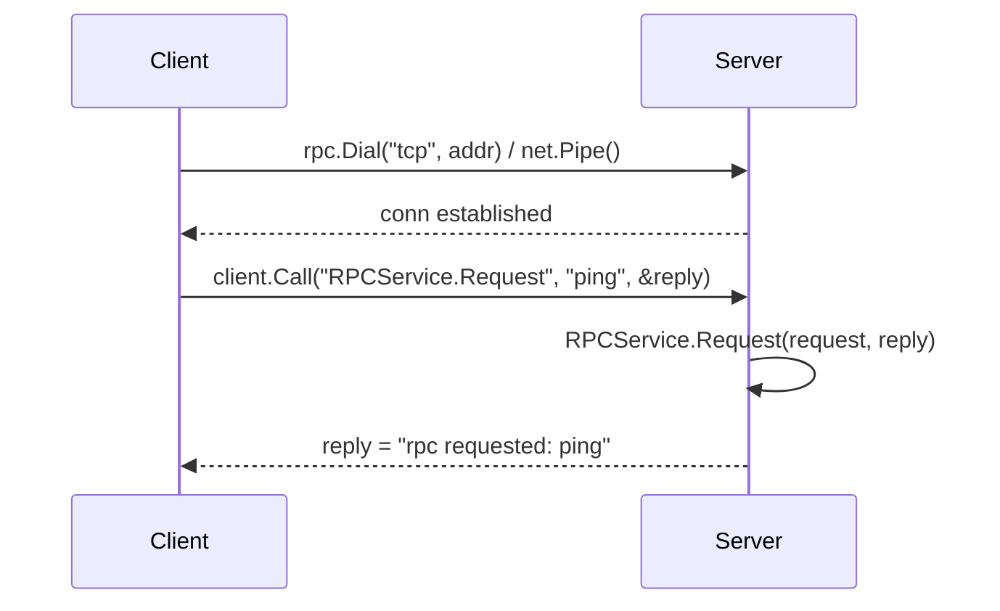

# RPC service with net/rpc

A minimal request/reply service built on Go's standard `net/rpc` package.

## Design



- `net/rpc` is Go's own RPC protocol (gob-encoded by default) — it is **not** gRPC, so tools
  like `grpcurl` cannot talk to it; there is no equivalent CLI probe for this protocol.
- A service method must be exported, take exactly two arguments (the second a pointer for the
  reply), and return `error`. `rpc.RegisterName` exposes it under `"RPCService.Request"`.
- Everything lives in `internal/rpc.go` — no separate `server`/`client` binaries. A real
  listener (`net.Listen` + `rpc.ServeConn`) or a test pipe (`net.Pipe`) both just hand a
  `net.Conn` to the same registered service.

## Implementation

`internal/rpc.go`:

```go
package internal

type RPCService struct{}

// Request follows the net/rpc method signature: exported, two args, second is
// a pointer for the reply, returns error.
func (r *RPCService) Request(request string, reply *string) error {
	*reply = "rpc requested: " + request
	return nil
}
```

## Tests

No real socket needed. Wire `rpc.ServeConn` and `rpc.NewClient` together with `net.Pipe()` —
an in-memory, in-process connection — so the whole round trip runs inside `go test`.

`internal/rpc_test.go`:

```go
package internal_test

import (
	"net"
	"net/rpc"
	"testing"

	"github.com/go-jose/go-jose/v4/testutils/assert"
	"github.com/nolannguyen1212/go-playground/internal"
)

// newClient wires a server and client together over net.Pipe, with no real
// socket and no fixed port, so tests never race over each other.
func newClient(t *testing.T) *rpc.Client {
	t.Helper()

	server := rpc.NewServer()
	if err := server.RegisterName("RPCService", new(internal.RPCService)); err != nil {
		t.Fatal(err)
	}

	serverConn, clientConn := net.Pipe()
	go server.ServeConn(serverConn)

	client := rpc.NewClient(clientConn)
	t.Cleanup(func() { client.Close() })

	return client
}

func TestRequest(t *testing.T) {
	client := newClient(t)

	var reply string
	err := client.Call("RPCService.Request", "ping", &reply)

	assert.Equal(t, err, nil)
	assert.Equal(t, reply, "rpc requested: ping")
}
```

```sh
go test -race ./internal/...
```

`net/rpc` + `net.Pipe` gives a fully in-process, deterministic test — grpcurl (or any manual
client) is unnecessary and, being gRPC-specific, wouldn't work against this protocol anyway.
